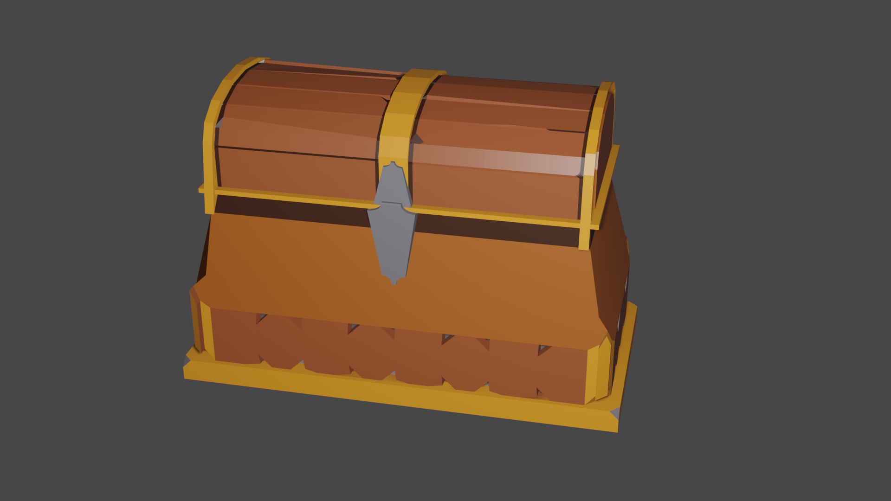
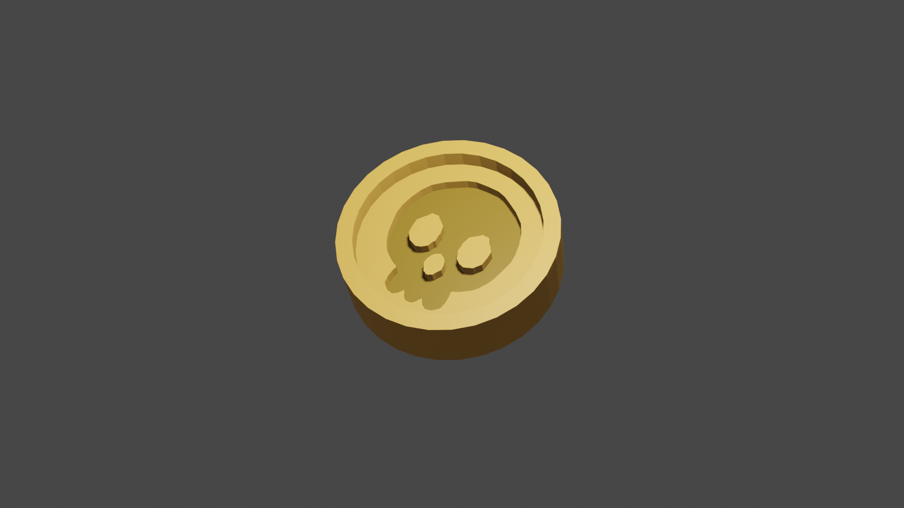
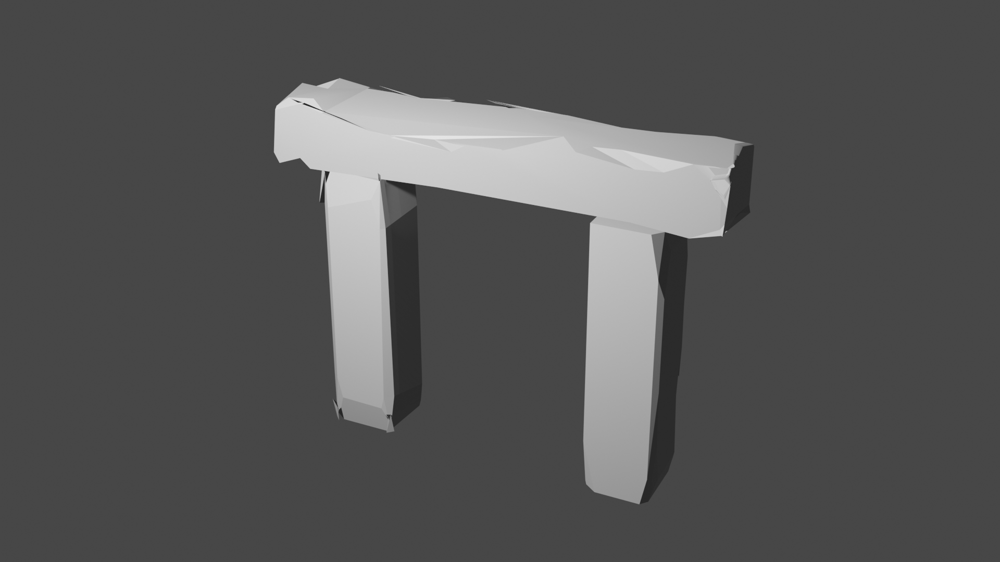
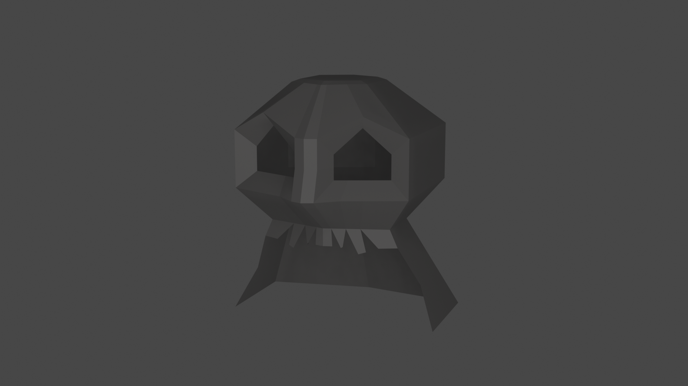
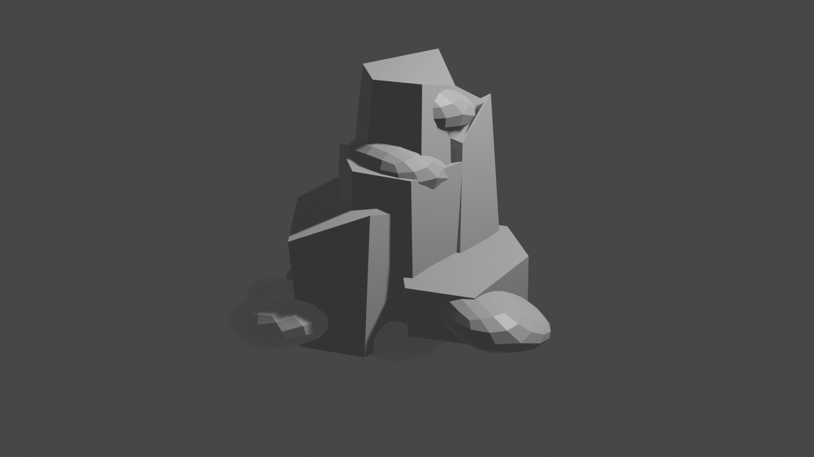
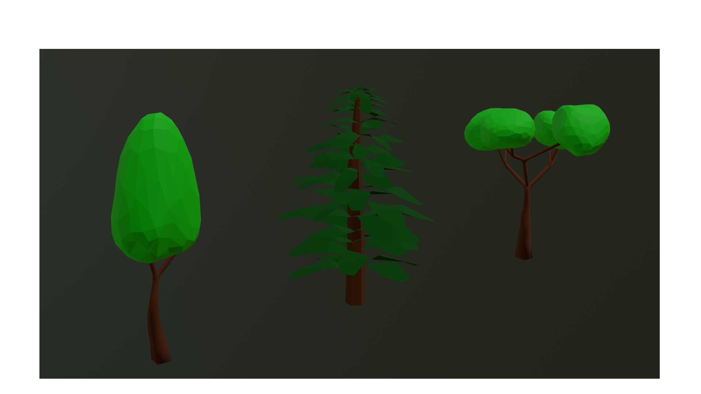
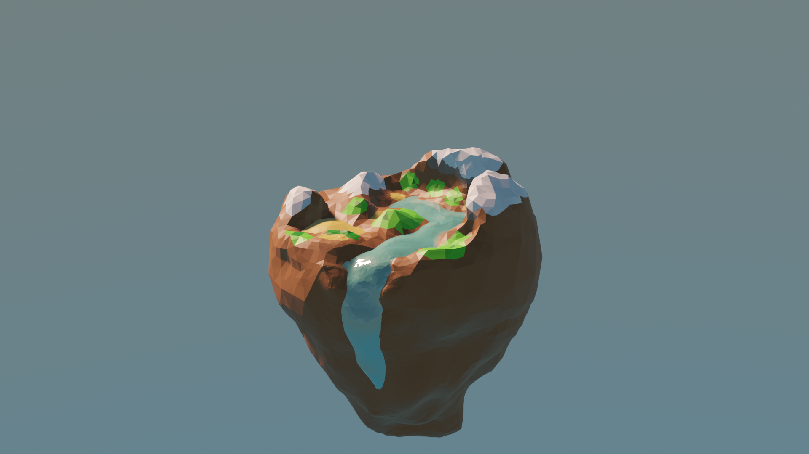
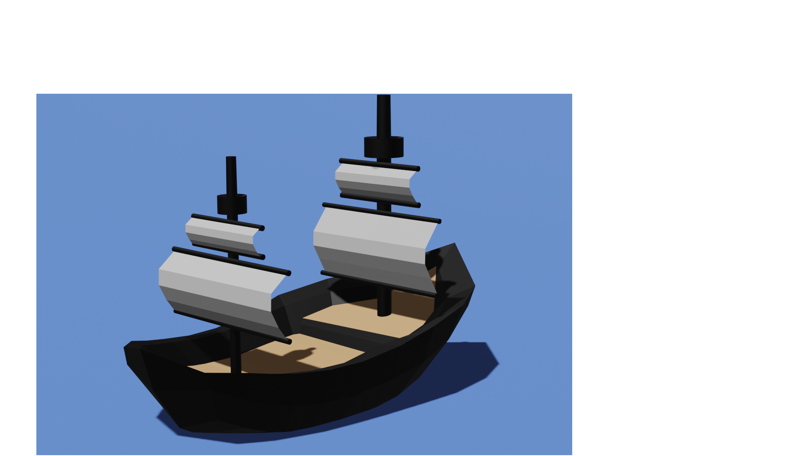
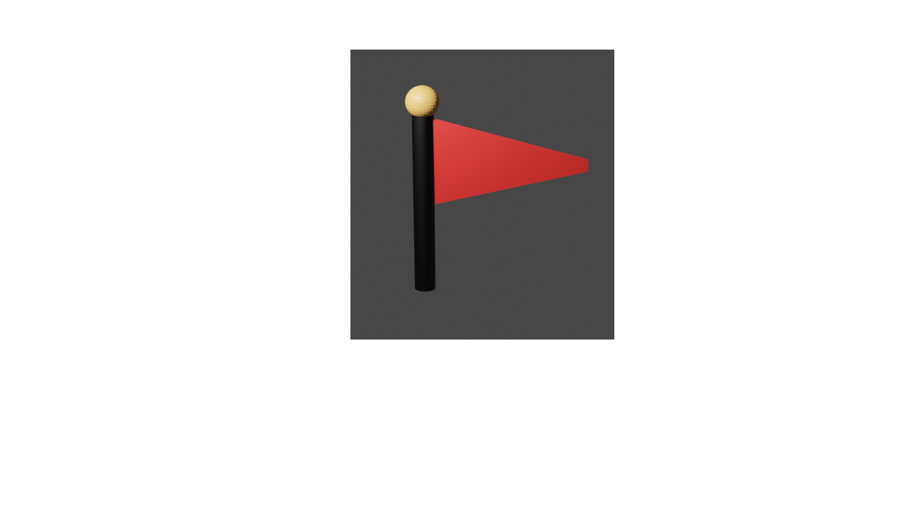
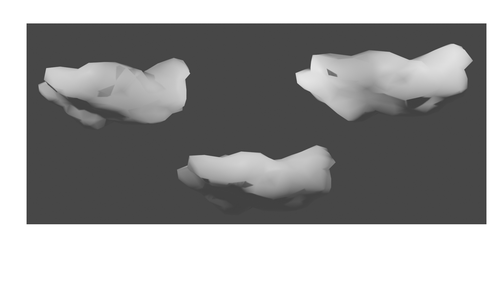

# 3D Graphics and Animation Coursework (Part 1)
## Work Done by Lakshmi

### Treasure Chest
#### Reference
##### https://www.youtube.com/watch?v=b2FHeyTS0uw&list=PLwyAa3_e5GYT0gRpowC7OB1YPHpExF3Wu&index=4
##### https://www.youtube.com/watch?v=ARqvL3sQjjY&list=PLwyAa3_e5GYT0gRpowC7OB1YPHpExF3Wu&index=5
#### How the scene was set up 
I made the treasure chest using the shape 'Cube', and used the bevel tool to make the top of the treasure chest.
#### Render output 

### Gold Coin
#### Reference
##### https://www.youtube.com/watch?v=r8ltW7pAN6M&t=256s
#### How the scene was set up 
I made the gold coin using the shape 'Cylinder'.
#### Render output

### Ancient Ruins Rock
#### Reference
##### https://www.youtube.com/watch?v=tspF37i8p2c&list=PLwyAa3_e5GYT0gRpowC7OB1YPHpExF3Wu&index=2
#### How the scene was set up 
I made the ancient ruin rock using the shape 'Cube', extended it and used the knife tool to cut it to make it more rough.
#### Render output
 

### Pirate Rocks
#### Reference
##### https://www.youtube.com/watch?v=DSrmO3YoNRw&list=PLwyAa3_e5GYT0gRpowC7OB1YPHpExF3Wu&index=2
#### How the scene was set up 
I made the pirate rock using the shape 'Cube', used the mirror to make the face and used the knife tool to cut it to make it more rough.
#### Render output

### Rocks
#### Reference
##### https://www.youtube.com/watch?v=DSrmO3YoNRw&list=PLwyAa3_e5GYT0gRpowC7OB1YPHpExF3Wu&index=2
#### How the scene was set up 
I made the rocks using the shape 'Cylinder' and 'Cube', changed the cylinder sides to 6 which made it into a hexagonal prism used the knife tool to cut it to make it more rough.
#### Render output

##Work done by Arshati

### Trees
### Reference
#### https://youtu.be/_GkSvXj_HXw?si=k2MVzU17tE1Zwbeb

#### https://www.youtube.com/watch?v=p-9pgZI3inI&ab_channel=GrantAbbitt
#### How the scene was setup
I made the trunk of two trees with the shape of cube and used a modifier named 'skin'. I made the trunk for the third tree with the shape of cylinder and adjusted according to how I wanted. To make it look like low poly, I used a modifier named 'decimate' and decreased the ratio.

### Render Output

### Floating Island with Mountains and Water
### Reference
#### https://youtu.be/0lj643VmTsg?si=gXcWQiW0tKQM_BUs

#### How the scene was setup
I made the island with mountains using the shape 'icosphere' with 3 subdivisions and scaled it accordingly. For the water, I used the shape 'plane', adjusted it and made the water look glossy by adding a shader, transparent shader and glossy BSDF in the shader editor.

### Render Output

## WORK DONE BY PRASITHA

### Pirate Ship
### Reference
#### https://www.youtube.com/watch?v=qFeWNR33b_A&list=PLob6hbUtmU2PLtPpgVO0sKNBuBwP0tQ-z&index=1

#### How the scene was set up
The object was made from a cube that was extended from both sides and bent in the middle to get the boat shape. Then after using various options like S, G, K, R, I was able to get the base of the ship done.

The poles with the sailing masts was done using 2 cylinders and 4 planes that were further edited upon to look like the ship is sailing forward..

I positioned the camera to capture the ship from a side angle and used a pointing light positioned in the left side to get the shadow and colors of the ship after adding different material colors to perfect the model.

### Render Output

### Flag Pole

### How the scene was set up
The flag pole was done using a cylinder which was adjusted using S and G and then a sphere was added on the top to make it more like a pole.
The Flag part was done using a plane on which the edge i scaled and reduced to make it like a trianglular flag.
Then furthermore i added material colors like red, black and beige to make it perfect and match the theme.

### Render Output

### Clouds

### How the scene was set up
The clouds were done using a ico-sphere. I edited the sphere in skulpt mode to reshape and extended it. To make it more cloud looking i added curves and smoothened up the edges and add a material white color as well.

### Render Output

